# My Personal Technology Stack: A Running List Of Recommendations!

I created this repository to host a periodically-updated list of my favorite tech products spanning pretty much all domains of use. 

I figure this might save me a bit of time in representing (mostly) the same products to friends, colleagues, etc.

**Changelog**

- Updated and added five stars for services that I *really* like! These are my strongest recommendations.

*(Latest updated: 01/04/24 or last commit ... whichever is later!)*

------

# Hardware, Infrastructure, Networking

## Desktop OS: Ubuntu Linux (LTS)

**Ubuntu Linux (LTS releases)**

I've been using Linux as my day to day OS for more than 15 years.

I've spent my fair share of time distro-hopping and have run Debian, Gentoo, Arch (among others) at different times.

But over time I've come to prefer a reliable LTS Ubuntu distro as the backbone of my system.

After one too many bad updates I've learned to stick to the LTS release cycle. 

------

## Virtualization (Desktop): VMWare Workstation (Ubuntu Host, Windows VM Guest) ⭐⭐⭐⭐

I'm just about old enough to remember the "bad old days" when emulators like WINE were just about the best hope for us Linux weirdos to be able to interface with the normal folk running Windows/MacOS.

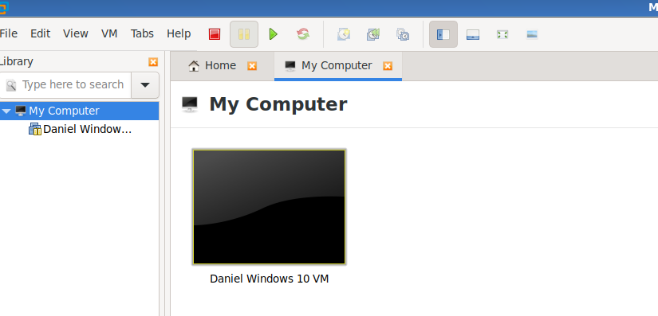

I switched from using **Openbox** to VMWare a few years ago and haven't looked back since. I find Genymotion useful too for the few times I need/want to emulate Android on Ubuntu.

I recently upgraded from VMWare Player (freeware) to VMWare Workstation Player (license-based). My rationale for doing so was that snapshotting, cloning, and moving Windows VMs is easier with Workstation. The Linux client is perfectly good.

------

## Desktop Environment: LXDE (Yes, Still!) (⭐⭐⭐⭐)

When I started using Linux I was a poor university student without a lot of disposable income.

LXDE allowed me to run Ubuntu on old hardware as if it were brand spanking new! Even though I finally own a desktop computer with some decent firepower in it, I've been using LXDE for so long that it's an impossible habit to break!

I played around with tiling window managers for a period (they're cool). But I think that LXDE strikes a happy medium between usability and minimalism (every time I use Windows or even Unity I'm blown away by how bloated the DEs are with graphic effects and the like)

------

## On My To-Do List Since Forever: Ansible 

I hate when I have a tech problem that I know there's a solution to but which I really don't have time to implement. Thus it is with me and Ansible.

I spend 95%+ of my computing time using a Linux desktop but I like to keep an Ubuntu laptop somewhat in sync so that I don't get an old config when I use it.  

I've looked into various ways to do this both intelligently and easily but have thus far come up short

Ansible or some other automation solution has been on my to-do list for ages.

------

## Computer & Hardware: Desktop Built By People-Who-Know-What-They're-Doing! (⭐⭐⭐⭐⭐)

Desktop or laptop?

Desktop  each and every day!

I use my laptop only when I'm travelling.

I've also been a longtime user of three horizontal displays. 

This is the monitor array that I've had the best success with for general productivity. 

I've tried both more and less and found that 3 is my personal sweet spot.

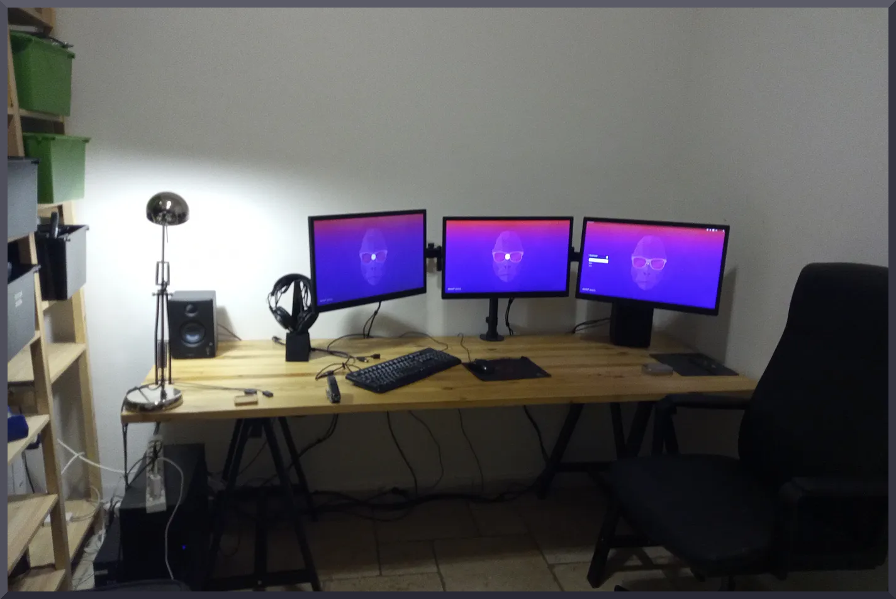

Multimonitor support on Ubuntu works out of the box these days and you can set up far more elaborate arrays than my relatively simple layout. If your graphic driver supports it and you have the cables .. you can make it happen.

I use **arandr** for configuring the layout. Once I've figured out the right parameters I save that as a Bash script which I execute automatically when I log into the DE.

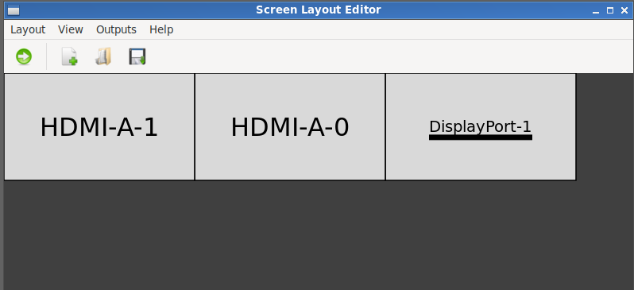

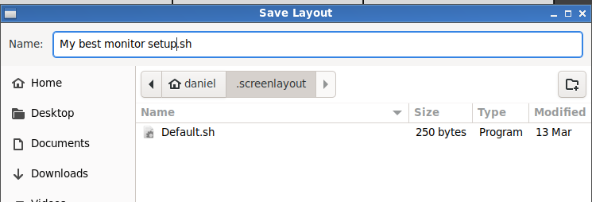

Here in Israel we have an interesting solution for buying desktops that I think would do well just about everywhere there are still desktop fans.

When you want to buy a desktop, you consult with a "tech guy" and together select the components. 

As a Linux user, I even save a little by avoiding wasting money on a Windows OS license that I'm not going to need! Both KSP and Ivory offer this sales model and it's how I've bought the two desktops I've owned to date (the current machine I'm typing this with and my previous computer).

I think it's an amazing happy medium between building your own computer (lots of work) and getting stuck with an off the shelf commercial build that's not going to contain exactly the components you want. 

------

## Proxmox For Hosting VMs and LXCs (⭐⭐⭐⭐⭐)

Although I make extensive use of Reddit for exploring its many excellent tech communities, I remain averse to describing my home computer and networking setup as a *"homelab".* I've read the threads explaining what it means but ... it still feels to me like an unnecessary piece of jargon. I like technology and find what it can do fascinating so I spend a sizeable chunk of my time and money working with it. Call it what you want.

One software that's popular among HomeLab-ers and which I love, however, is [Proxmox](https://www.proxmox.com/en/proxmox-virtual-environment/overview). 

Did you ever find yourself wondering: "*how helpful would it be if somebody built an operating system whose only job was to host virtual machines and containers?*". Spoiler alert: It exists. It's Proxmox!

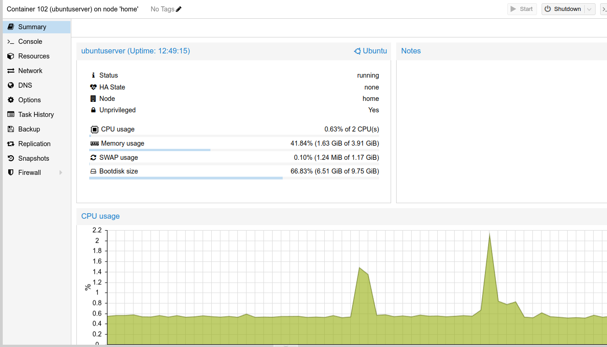

Proxmox has made it *massively* easier for me to mess around with VMs and Containers and ... explore tech more deeply in general. You can run servers on it. Virtual desktops on it. Containers. VMs. Or all of the above at once. And if you're judicious about how you allocate resources, you might even be surprised as to what it can run off. 

Currently I'm hosting Proxmox on an Aliexpress mini PC that was originally purchased with the hope that it could be a nice networking appliance to bond up Speedify connections and serve them to the network. 

Fiber optic internet arrived before I figured out how to do that so it's been repurposed. I'll probably set up a new cluster on an old desktop.

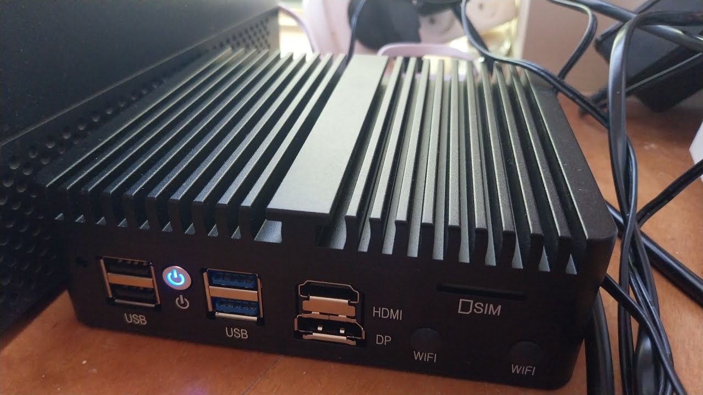

Everybody encounters tech differently, but I personally find Proxmox pretty intuitive to use. 

I'm relatively new to the idea of owning computers that are actually powerful enough to run multiple VMs seemlessly so the novelty of having a box just for that is still fresh. Putting them on my Proxmox host means that I can forget about any strain on my local machine and just make sure that's properly resourced.  It also means that the applications are accessible from any LAN computer. 

So far I've used Proxmox:

- To run a general purpose Ubunu Linux container (LXC) for hosting just about anything, including Docker and Portainer (both of which I've come to love)
- To run Home Assistant OS as a VM
- To run a dedicated backup server (just another Ubuntu LXC. I didn't see much advantage in the Proxmox Backup Server / PBS over this)

Also useful:

- If you have an NAS and a Proxmox host on your network you can take VM or container-level backups over the LAN (just setup an NFS share on the NAS volume you wish to use as a target). From a backup standpoint, I would argue that this is a *huge* benefit not to be sniffed at. Far too many applications still don't bother developing a robust backup methodology. 

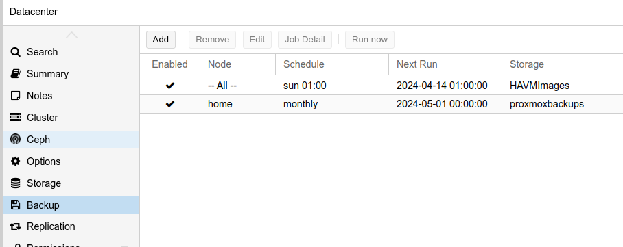

------

## NAS: Synology - The Hardware Accessory My Backup Addiction Was Crying Out For All These Years (⭐⭐⭐⭐)

Another piece of hardware that I get a lot of mileage out of is my Synology NAS (I use a DS920). I've tried out TrueNAS and other platforms before but *mostly* actually prefer the Synology. 

Before discovering Proxmox, I hosted some VMs and container on it with less than amazing performance. I've reverted to using it as a big dedicated backup appliance (my backups aren't that 'heavy' so even with "measly" 1TB drives I have a lot of space sitting idle). 

I move backups onto it and sync backups up to and down from various clouds. It can do just about anything a server can do, of course. But I've decided that it's best to keep it focused on backups.

Backups running on my NAS *(non-exhaustive, to give a flavor for the utility of NASes)*

-> Back up self hosted stuff to a cloud automatically, please

-> Here's an image of my desktop just in case it fails. Store it and put a copy up to the cloud too, please.

-> Here's an image of my Home Assistant OS that I took at a date and time when everything was working okay.

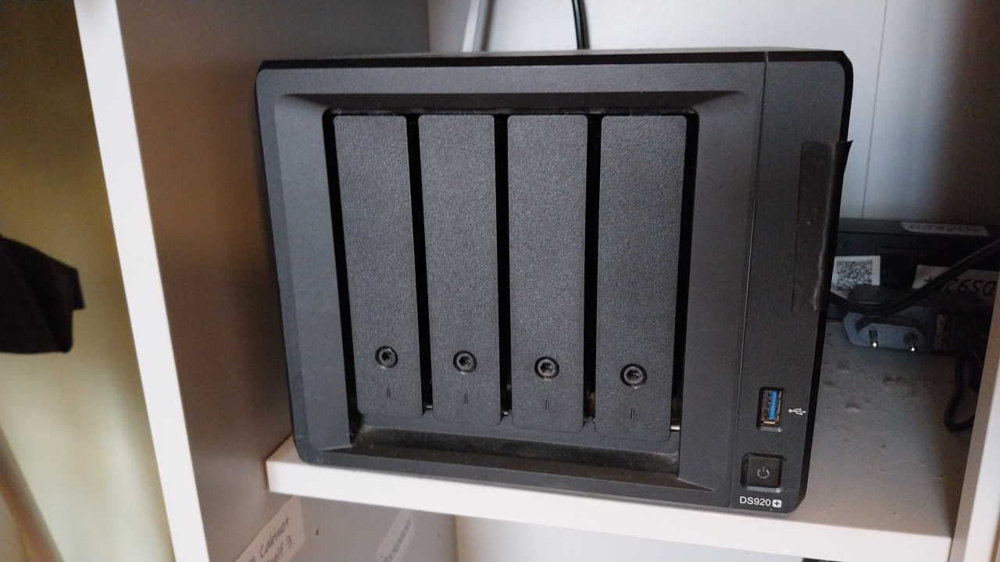

Rating: ⭐⭐⭐⭐ because Synology still insists on locking down some stuff that should really not be locked down and ... upgrading the RAM is unnecessarily annoying and hard.

------

## Tailscale For Remotely Accessing Locally-Hosted Services(⭐⭐⭐⭐⭐)

I recently got back into self-hosting "stuff" after a very long break away from that "world". The familiar problem presented itself: how can I create some kind of remote access system that isn't horribly unsecure. 

I tested both Tailscale and Cloudflare Access and for me Tailscale is the clear winner.

You can set up Tailscale on a VM, Container, physical machine ... just about anything. The admin-ing is done via a web UI and you can even expose subnet routes to access local IPs from the WAN.

## Better, More Reliable Internet: Speedify

[Speedify](https://www.speedify.com) is one of the very few technologies out there that I can get mildly evangelistic about. 

Did you ever wonder why you can't take your mobile internet and a WiFi hotspot and sort of .... mush them into one "super" connection?

Well, you can. And after waiting far too many years for fiber optic internet to finally roll out in my neck of the woods, Speedify quickly became my go-to (I [joined their livestream](https://speedify.com/event/talking-global-connectivity-home-networking-and-remote-work-speedify-live/) to share my thoughts.)

------

## Web Hosting: Digital Ocean (Protected By SnapShooter For Backups)

I have a bunch of old and barely-visited websites sitting on cPanels that I can't bring myself to delete (*the sunk cost fallacy is a strong one eh?*) and hence I continue paying to keep them doing pretty much nothing. 

I recently decided that it was time to set up a renewed push at tech blogging ([danielontech.com]()). 

After trying and failing to wrap my head around static website generators I ended up deploying a Ghost CMS instance on Digital Ocean (I should really add Ghost to this list but it still has a couple of frustrating UI blind spots). 

Whenever I set up just about anything new, backups are one of the first things I look at. 

Snapshooter offered outstanding support to help me get a simple backup job running (note: I have no incentive to recommend them. I just appreciate great support in this era of chatbot-centric tier 1 misery)

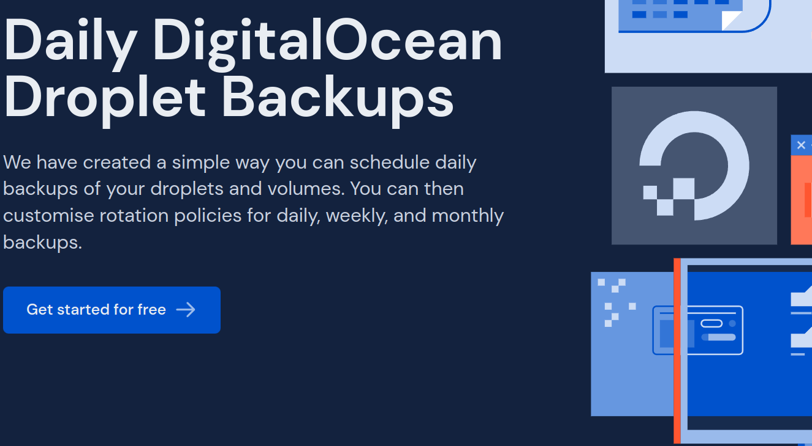

------

# Software, Apps

*My guiding principle since forever is always to use the bare minimum amount of desktop software. I try to use SaaS however and wherever I can. Although the dream of "thin computing" has been relegated to tech lore, it still represents a pretty good articulation of my ideal "version" of technology.* 

------

## Github For Open-Sourcing Whatever I Can (⭐⭐⭐⭐⭐)

The purists of the world might argue that sharing my personal tech stack by sharing a markdown file on Github is an abuse of what Github's supposed to be and a waste of the bits and bytes they're kind enough to offer us.

*I would strongly contest that idea.* 

I think that open-sourcing goes way beyond methodologies and VCS-s. It's (*yes, this bit is cheesy*) an approach to life that emphasises the value of sharing know-how wherever and however possible. 

Feel free to browse my repos to see what else is currently tickling my technical interest. 

*Ergo: YouTube, blogging*

------

## Home Automation: Home Assistant OS (⭐⭐⭐)

I always assumed that I'd have to be a home-owner to play around with home automation (if I ever become one, that is). 

When my wife and I rented an apartment that came unexpectedly *"preconfigured"* with Zigbee plugs, I was forced to learn about home automation if I wanted to use the bathroom with the lights on...

I've been slowly coming to grips with YAML and writing up some automations and code snippets here. My tech blog ([danielontech.com]()) has a few write-ups.

Some dashboards and other things I've built and/or am building:

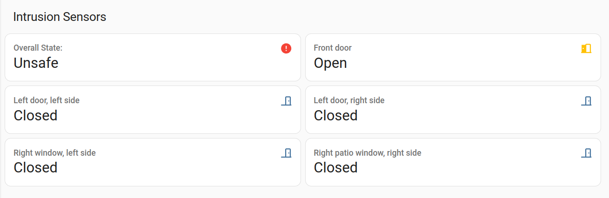

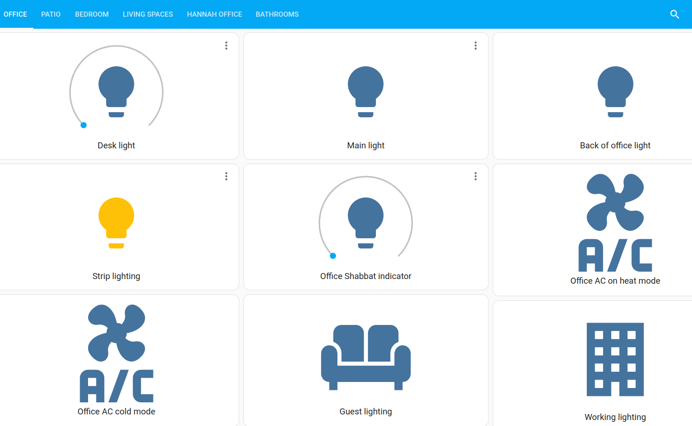

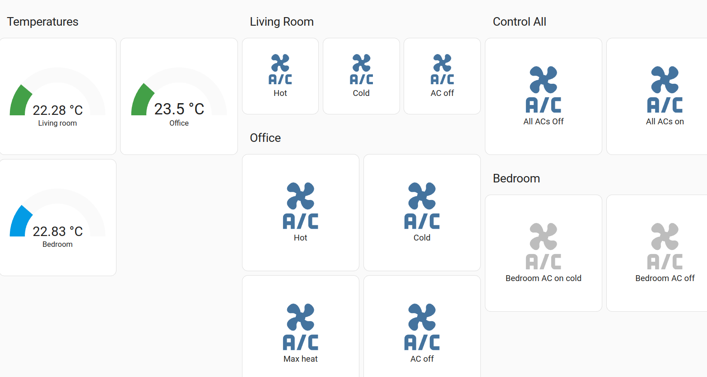

I also made my own little shopping list system. 

Check out my other repos!

------

***General feelings about Home Assistant:***

- I see a parallel between where HAOS is today and where Linux was in the early 00s. It's still way too hard (IMO) to "just get stuff done". Yes, it's amazing. No, it's not anywhere near user-friendly enough.
- I'm in it for the long haul but equally I've reached a point at which I'm done investing large amounts of time in Home Assistant to get it to do simple things. 
- YAML can be tedious. Really tedious!

------

## NFC Accessories & NFC Tools

To inventorize pretty much everything I own, I got "into" label printing (there was no way A4 templates were going to keep up with the pace!). However I kept hearing that I should give NFC tags a try and eventually succumbed.

NFC tags are pretty great and I've been using them both for labelling inventory and for driving home automations (see: desktop). 

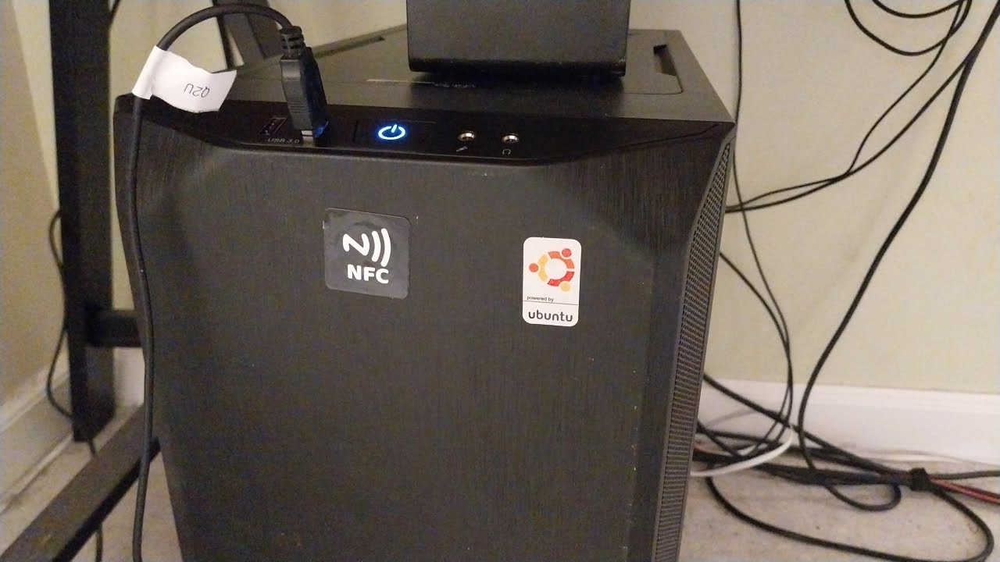

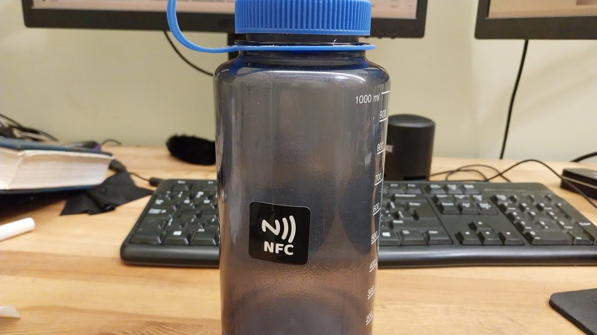

I love the fact that NFC is:

- Common enough to not be totally obscure
- Hobbyist enough to have a really good ecosystem supported by some great tag vendors

For writing tags, I find using a desktop USB reader/writer far more practical. I like NFC Tools (@nfc-tools) for this purpose although the GoGoTags (@gogotags) team seem very engaged and on-the-ball too.

Oh, and [Shop NFC](https://www.shopnfc.com/en/) deserve an honorable mention also for their wonderful, patient customer support.

------

## Typora For Drafting Markdown Files (Like This One) - ⭐⭐⭐⭐⭐

Another emphatic recommendation for a tool that also runs on Linux!

I thought I had recently: I've probably paid for more software licenses this year than in any previous one.

Some of them are relatively small-ticket purchases (like: @typora and Obsidian). Others are a little pricier. 

Although I'm far from wealthy, I feel privileged enough to be able to pay for the odd subscription or sponsorship just because I think the project is awesome. We can't keep great open-source and Linux projects going if financially they're running on ether. I think an affordable subscription model offers the perfect middle ground between developing unsustainable freeware and the awkwardness of asking users to donate.

[Typora](https://www.typora.io) is what I'm currently using to draft this in and I absolutely *love* the UI (I forget that it's a markdown editor). I have wasted more than my fair share of time looking for the "ultimate" distraction-free writing experience (as I grow older I realise: this is just another epic form of procrastination). Typora lets me output to markdown while hiding me from all the little syntax edits that drive me crazy. 

------

## Obsidian For Note-Taking

I take a lot of my software-searching cues from the far too many tech subreddits I'm subscribed to.

The internet is awash with AI generated "reviews" written by bots or authors who have never actually tested the products they're writing about. 

I actually think that Reddit strikes the best balance of all social networks when it comes to dealing with people whose job it might be to post positive things about what they're selling.  Do it with tact and declare your interests and people can judge for themselves. 

[Obsidian](https://www.obsidian.md) is what I'm hoping will replace my current ridiculous system for reminding myself of to-dos and other such things (I shifted from Todoist to just creating a vast amount of Google Calendar events a few years ago and the system just about works well enough to create the inertia needed to wedge me to it)

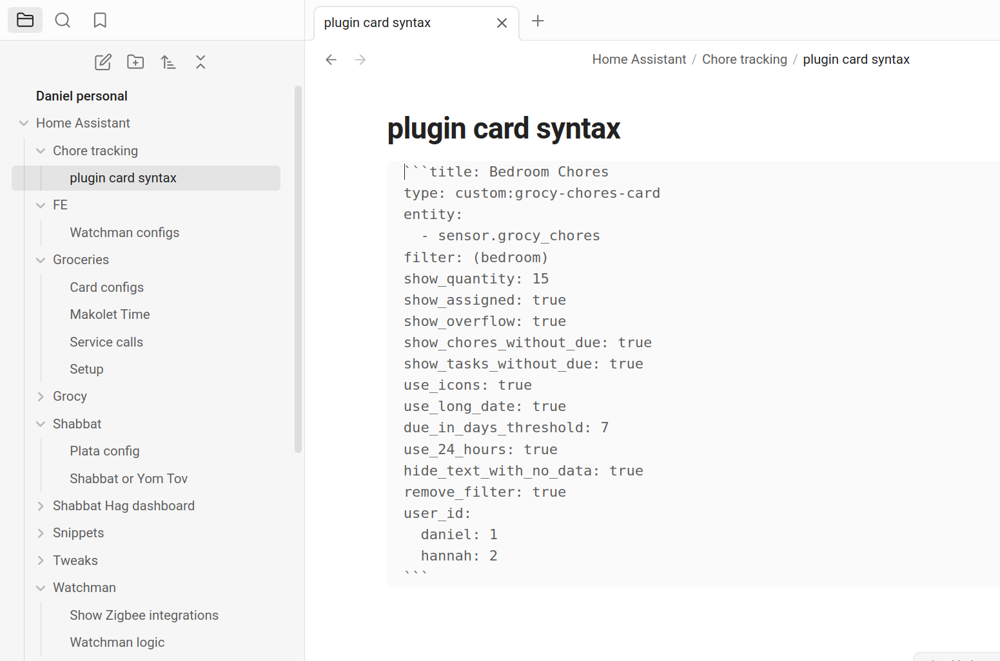

------

## Modern CSV For Less Terrible CSV Editing On Ubuntu

[Modern CSV](https://www.moderncsv.com) is another little utility that I discovered lately and which I'm enthusiastic about.

I'm currently trying to visualise some data with the objective of possibly integrating it into an Android app. 

I've come to realise *(data scientists please feel free to correct me)* that starting with a solid, clean CSV file is always a prudent move. 

Libre Office Calc and Google Sheets are both a bit clunky. I like Modern CSV a lot better. 

------

## IDE: Visual Studio Code (Yes, On Linux)

What an interesting point we've reached in the evolution of software at which a product by Microsoft provides possibly the best development environment on Linux!

Although I'm a big tech fan, I am NOT a "coder" (that's putting it kindly). Previous attempts to learn Python have ended with me banging the keyboard in frustration. Sure I can use the Linux terminal and come up with the odd Bash script but ... there's a huge gap between what I do (and intend to do) and what proper programming actually entails.

Nevertheless, I like Visual Code Studio a lot as an IDE.

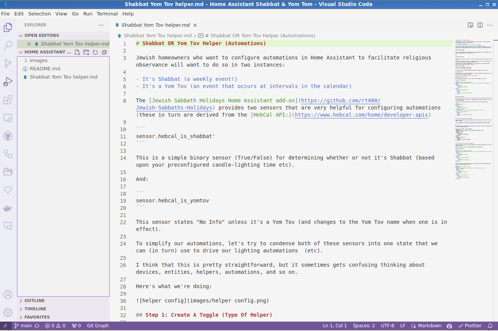

## Cursor (Cursor.sh) For AI-Assisted Development/Coding 

And here's a VERY cool one. [Cursor](https://cursor.sh/) (@getcursor) (really, really worth checking out; Recommendation via Reddit).

I actually love the idea of AI-assisted code generators because I think they can provide an ideal solution for people with brains like mine (love tech; very creative if you can excuse the self-flattery; but neurologically incapable of "getting" coding!)

Instead of struggling with whitespaces and indentations, what if we could just type out some commands to a friendly AI chatbot? I played around with feeding some prompts into Cursor last night (it uses GPT-4) and .. I was impressed. The always-picky Home Assistant accepted my YAML and I got a new automation running!

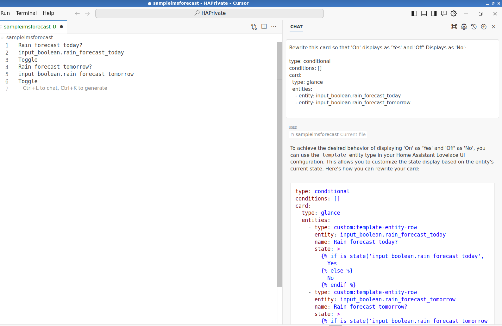

## Metabase: Data Visualizations For Non-Geniuses (Self-Hostable)

As I have some kind of server back up and running for the first time of years  (thank you, Proxmox!) I find myself drawn to checking out the world of self-hostable everything again (unlike the last time I was looking into this, these days it seems like almost everything is containerized!).

So far I like [Metabase](www.metabase.com) the best. 

I imagine that true data scientists and gurus are scoffing at the suggestion. But:

- I really like the UI
- It's free if you self-host
- It's "complicated" enough to help those new to data analysis (or rusty in its principles) to freshen up on database types, etc.

I've been using it to import datasets from a few interesting products in the realm of impact accounting and create some (for now) very basic visualisations.

## Homebox For Home Inventory Management (Self Hostable)

I'm still a bit exhausted from the process of creating an inventory of ... most stuff that I own ... and storing it on a self-hostable open-source project called [Homebox](https://github.com/hay-kot/homebox) (@homebox). 

Homebox is great. Print QR codes (or "bring your own" NFC tags) and create an inventory of all your "stuff".

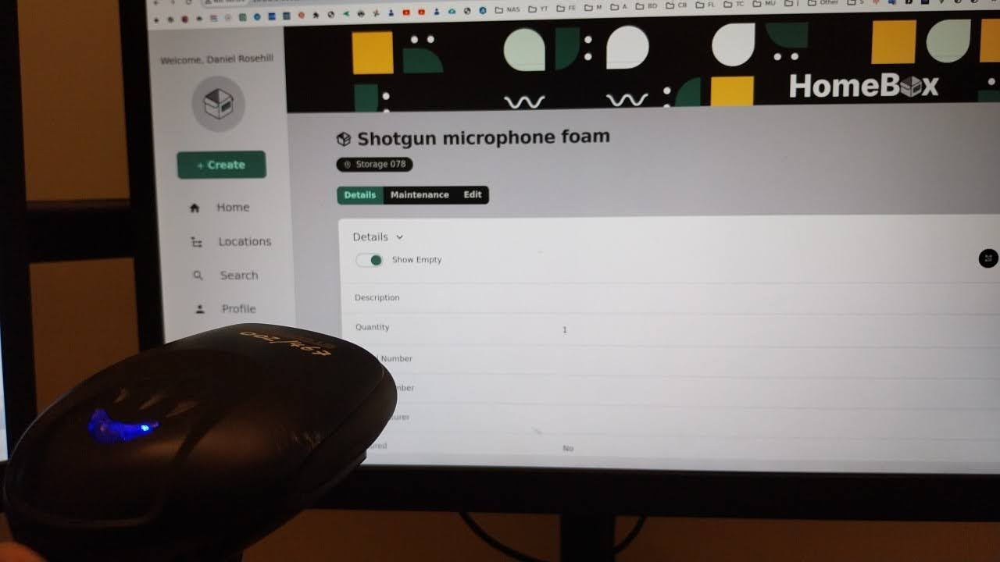

------

## Other Software I Really Like

- [GitKraken](https://www.gitkraken.com/) for Git repository management 
- Android Studio (learning)
- Blender (always on my "to learn" list)

------

## Backup and Recovery Software

I have a *lot* of thoughts about backup and recovery. One of them is that consumer SaaS backup is still way behind where it should be. But short of creating my own startup, I'm not sure there's anything I can do to fix that. 

Here are my truly indispensable tools:

### Clonezilla / Rescuezilla / Image-Level Backup Utilities

I know that this is dumb, but I have a very hard time having full trust in any backup solution (for a desktop target) that is file-based.

Perhaps it's the old-school UI. Maybe it's the text stating that it's endorsed by the impressively-titled "Center For High-Performance Computing, Taiwan". Or maybe it's the fact that a lot of people have very good things to say about it. But either way I really like Clonezilla (and Rescuezilla).

You can take a very solid backup of whatever you're running by creating a live disc and backing up the system onto an external form of storage. 

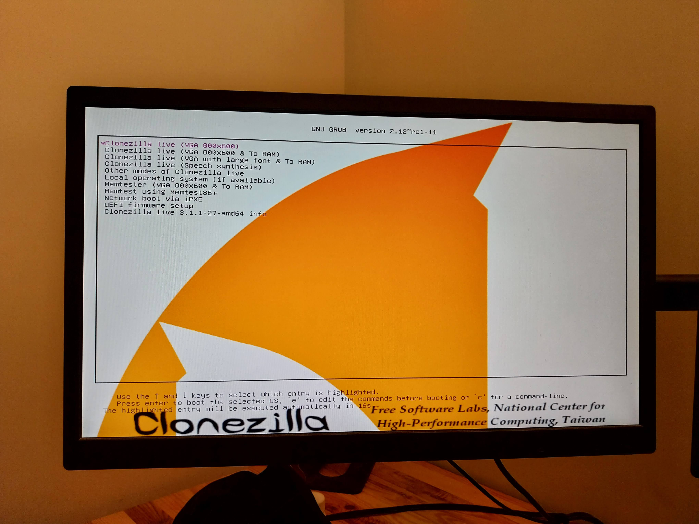

## Backblaze B2

Although I use good old optical media for archiving video and photo data, I still see a lot of utility in cloud storage for hosting offsite backups (and remember: a backup isn't really a backup until it's got an offsite copy!). 

# Summary Of Recommendations

*Like this post, periodically updated (maybe)*

| **Use**                                                | **What I Like**                                            | Free / Paid          |
| ------------------------------------------------------ | ---------------------------------------------------------- | -------------------- |
| **Hardware, Networking, Infrastucture**                |                                                            |                      |
| Desktop OS                                             | Ubuntu Linux                                               | Free                 |
| Virtualizing Windows in Linux                          | VMWare Workstation, VMWare Player                          | Paid, Free           |
| Desktop computers                                      | Pre-assembly based on custom component selection (service) | Paid                 |
| Self-hosting - VMs, LXCsc, Docker Containers, Whatever | Proxmox Virtual Environment                                | Free                 |
| Backup and file server                                 | Synology NAS                                               | Paid                 |
| Remote access to local resources                       | Tailscale                                                  | Free Tiers Available |
| Connection bonding; enhanced remote connectivity       | Speedify                                                   | Paid                 |
| Affordable online VPS hosting                          | Digital Ocean                                              | Paid                 |
| Code repositories, open-sourcing                       | Github                                                     | Free                 |
| Home automation                                        | Home Assistant OS                                          | Free                 |
| NFC                                                    | NFC Tools, NFC Shop                                        | Depends              |
| **Misc Software, Especially Linux-Friendly**           |                                                            |                      |
| Drafting Markdown (.md) files                          | Typora                                                     | Paid                 |
| Markdown-friendly note taking                          | Obsidian                                                   | Both                 |
| Editing CSV files (on Ubuntu)                          | Modern CSV                                                 | Free and Paid Tiers  |
| IDE                                                    | Visual Studio Code                                         | Free                 |
| AI-assisted development                                | Cursor (Cursor.sh)                                         | Free and Paid Tiers  |
| **Self-Hostable Apps, Containers**                     |                                                            |                      |
| Data Visualisation                                     | Metabase                                                   | Free (self-hosted)   |
| Inventory manager for the home user                    | Homebox                                                    | Free                 |
| Image level backup                                     | Clonezilla                                                 | Free                 |
| Object storage                                         | Backblaze B2                                               | Paid                 |

----

Written by: Daniel Rosehill (public at danielrosehill dot com)
